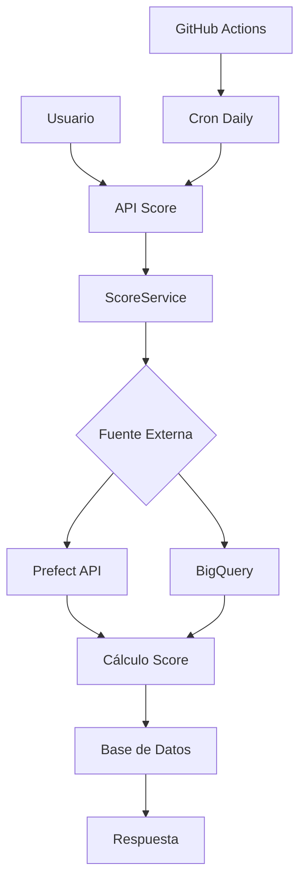

# Score Module

## Descripción
El módulo Score maneja la sincronización y gestión de scores crediticios desde orquestadores externos como Prefect y BigQuery.

## Funcionalidades

### 1. Sincronización Individual
- **Endpoint:** `POST /score/sync-one`
- **Descripción:** Sincroniza el score de un usuario específico
- **Body:**
  ```json
  {
    "email": "usuario@email.com", // Opcional
    "userId": "uuid-usuario"      // Opcional
  }
  ```

### 2. Sincronización Diaria
- **Endpoint:** `POST /score/sync/daily`
- **Descripción:** Ejecuta la sincronización masiva de todos los usuarios activos
- **Automático:** Se ejecuta diariamente a las 2:00 AM UTC via GitHub Actions

### 3. Consultas de Score
- **Latest:** `GET /score/user/:userId/latest` - Score más reciente
- **History:** `GET /score/user/:userId` - Historial completo del usuario
- **All:** `GET /score?page=1&limit=10` - Lista paginada de todos los scores
- **By ID:** `GET /score/:id` - Score específico por ID

### 4. Gestión
- **Delete:** `DELETE /score/:id` - Eliminar un score específico

## Flujo de Datos



## Configuración

### Variables de Entorno
```env
# Prefect Configuration
PREFECT_API_URL=https://api.prefect.cloud
PREFECT_API_KEY=your_prefect_api_key
PREFECT_WORKSPACE_ID=your_workspace_id
PREFECT_SCORE_FLOW_ID=your_flow_id

# BigQuery Configuration
BIGQUERY_PROJECT_ID=your_project_id
BIGQUERY_DATASET=fintech_scores
BIGQUERY_TABLE=user_scores
GOOGLE_APPLICATION_CREDENTIALS=/path/to/service-account.json

# GitHub Actions
GITHUB_TOKEN=your_github_token
GITHUB_REPO=owner/repo-name
GITHUB_WORKFLOW_ID=daily-score-sync.yml

# API Configuration
API_BASE_URL=https://your-api.com
API_TOKEN=your_bearer_token
```

## Estructura de Datos

### Score Entity
```typescript
{
  id: string;          // UUID del score
  user: User;          // Relación con usuario
  value: number;       // Valor del score (300-900)
  details: {           // Detalles adicionales en JSONB
    source: string;    // 'prefect_bigquery'
    rawData: any;      // Datos completos del cálculo
    syncedAt: Date;    // Fecha de sincronización
  };
  createdAt: Date;
  updatedAt: Date;
}
```

### Score Details Structure
```json
{
  "source": "prefect_bigquery",
  "rawData": {
    "score": 750,
    "factors": {
      "payment_history": 0.35,
      "credit_utilization": 0.30,
      "length_of_history": 0.15,
      "credit_mix": 0.10,
      "new_credit": 0.10
    },
    "bureau_data": {
      "veraz": { "score": 750, "risk": "low" },
      "nosis": { "score": 720, "risk": "medium" }
    },
    "calculated_at": "2024-01-01T00:00:00.000Z"
  },
  "syncedAt": "2024-01-01T00:00:00.000Z"
}
```

## Implementación Externa

### Prefect Integration
Para conectar con Prefect, actualizar el método `fetchScoreFromExternal`:

```typescript
private async fetchScoreFromExternal(email: string, dni: string): Promise<any> {
  const response = await fetch(`${externalApisConfig.prefect.baseUrl}/flows/${externalApisConfig.prefect.flowId}/run`, {
    method: 'POST',
    headers: {
      'Authorization': `Bearer ${externalApisConfig.prefect.apiKey}`,
      'Content-Type': 'application/json'
    },
    body: JSON.stringify({
      parameters: { email, dni }
    })
  });
  
  return await response.json();
}
```

### BigQuery Integration
```typescript
import { BigQuery } from '@google-cloud/bigquery';

private async fetchScoreFromBigQuery(email: string, dni: string): Promise<any> {
  const bigquery = new BigQuery({
    projectId: externalApisConfig.bigquery.projectId,
    keyFilename: externalApisConfig.bigquery.keyFilename,
  });

  const query = `
    SELECT score, factors, bureau_data, calculated_at
    FROM \`${externalApisConfig.bigquery.projectId}.${externalApisConfig.bigquery.dataset}.${externalApisConfig.bigquery.table}\`
    WHERE email = @email OR dni = @dni
    ORDER BY calculated_at DESC
    LIMIT 1
  `;

  const [rows] = await bigquery.query({
    query,
    params: { email, dni },
  });

  return rows[0];
}
```

## Monitoreo y Logs

### Logs Importantes
- ✅ Score sincronizado exitosamente
- ❌ Error al sincronizar score
- 📊 Sincronización diaria completada
- 🚨 Fallos en sincronización masiva

### Métricas Recomendadas
- Número de scores sincronizados por día
- Tiempo promedio de sincronización
- Tasa de errores por fuente externa
- Distribución de scores por rangos

## Testing

### Unit Tests
```bash
npm run test score.service.spec.ts
npm run test score.controller.spec.ts
```

### Integration Tests
```bash
npm run test:e2e score.e2e-spec.ts
```

## Deployment

1. Configurar variables de entorno
2. Ejecutar migraciones de base de datos
3. Configurar GitHub Actions secrets
4. Verificar conectividad con APIs externas
5. Probar sincronización manual
6. Activar cron job diario
